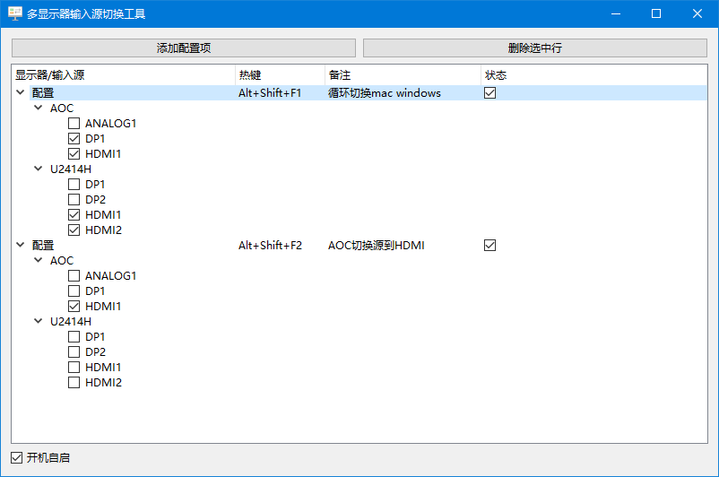

# DisplayInputSwitcher


**DisplayInputSwitcher** 是一个用于 **多显示器输入源快速切换** 的 Windows 桌面工具，支持热键切换、开机自启、托盘后台运行。适合拥有多设备、多输入源（HDMI/DP/VGA 等）显示器的用户，提升切换效率。

## ✨ 功能特点

- 🎛️ 支持多台显示器的输入源配置
- ⚡ 一键热键切换输入源组合
- 🖥️ 图形化界面直观编辑配置
- 🔧 开机自启 / 后台托盘运行
- 💾 配置自动保存至本地 `config.json`
- ⚠️ 仅支持 Windows 系统，需管理员权限访问显示器 VCP 接口

## 📦 安装运行

### 方式一：下载可执行文件

1. 访问 [Releases](https://github.com/rrsyycm/DisplayInputSwitcher/releases) 页面下载最新版
2. 解压并运行 `DisplayInputSwitcher.exe`
3. （可选）勾选“开机自启”以后台运行

### 方式二：源码运行

```bash
git clone https://github.com/rrsyycm/DisplayInputSwitcher.git
cd DisplayInputSwitcher
pip install -r requirements.txt
python main.py
```
## 🎥 使用演示

## 🧩 技术实现
- Python 3.10+
- PySide6（GUI）
- monitorcontrol（显示器控制）
- keyboard（全局热键监听）
- winreg（注册表自启）

## 🛠️ 项目结构
```bash
DisplayInputSwitcher/
├── main.py               # 主程序入口
├── config.json           # 配置文件（自动生成）
├── icon.ico           # 图标资源
├── README.md
└── requirements.txt
```
## 📌 命令行参数
| 参数         | 说明        |
| ---------- | --------- |
| `--hidden` | 启动后不显示主界面 |

示例：

```bash
DisplaySwitcher.exe --hidden
```

## 📄 License
[MIT License](LICENSE)